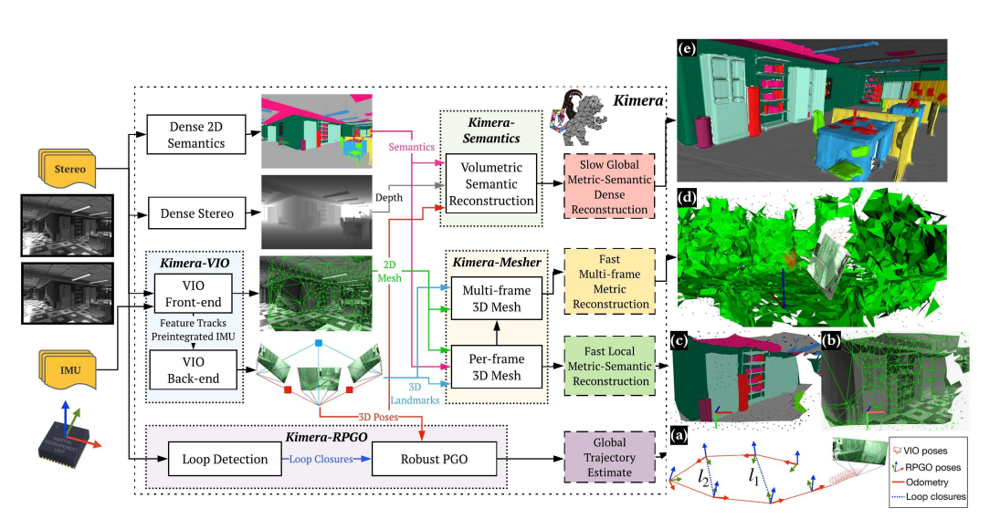

# Kimera [[github](https://github.com/MIT-SPARK/Kimera)] [[video](https://youtu.be/-5XxXRABXJs?si=w-ihrKiicGH4cP0B)]

The library goes beyond existing visual and visual-inertial SLAM libraries (e.g., ORB-SLAM, VINS-Mono, OKVIS, ROVIO) by enabling mesh reconstruction and semantic labeling in 3D. Kimera is designed with modularity in mind and has four key components: a visual-inertial odometry (VIO) module for fast and accurate state estimation, a robust pose graph optimizer for global trajectory estimation, a lightweight 3D mesher module for fast mesh reconstruction, and a dense 3D metric-semantic reconstruction module.

Kimera comprises four modules:

+ Visual-Inertial Odometry (VIO) Module: A fast and accurate Visual Inertial Odometry (VIO) pipeline ([Kimera-VIO](https://github.com/MIT-SPARK/Kimera-VIO))
    + This module rapidly and accurately estimates the robot's state (e.g., position, velocity) using data from cameras and Inertial Measurement Units (IMUs).
    + It processes raw sensor data, tracking visual features across frames and integrating IMU data to maintain an accurate estimate of the robot's trajectory.

+ Pose Graph Optimization (PGO): A full SLAM implementation based on Robust Pose Graph Optimization ([Kimera-RPGO](https://github.com/MIT-SPARK/Kimera-RPGO))
    + Kimera includes a robust pose graph optimizer that detects loop closures (instances where the robot revisits a previous location) and adjusts the trajectory estimate globally to ensure consistency.
    + It includes advanced techniques for rejecting erroneous data (outliers) to enhance robustness.

+ 3D Mesher Module: A per-frame and multi-frame 3D mesh generator ([Kimera-Mesher](https://github.com/MIT-SPARK/Kimera-VIO))
    + This component quickly reconstructs a 3D mesh of the environment, which is crucial for obstacle avoidance and navigation.
    + The mesher builds both local meshes (short-term 3D reconstructions) and more comprehensive multi-frame meshes.

+ 3D Metric-Semantic Reconstruction: And a generator of semantically annotated 3D meshes ([Kimera-Semantics](https://github.com/MIT-SPARK/Kimera-Semantics))
    + This module creates a detailed, semantically labeled 3D mesh of the environment by combining visual data with 2D semantic segmentation (e.g., identifying objects like tables, walls).
    + It uses a volumetric approach to refine the global mesh for better accuracy.

[[EuRoC dataset](https://projects.asl.ethz.ch/datasets/doku.php?id=kmavvisualinertialdatasets)] [[Metric-Semantic SLAM with Kimera: A Hands On Tutorial](https://youtu.be/Zjevg5wQTdI?si=GxCRuOc2bysBU-fy)] [[Kimera: from SLAM to Spatial Perception with 3D Dynamic Scene Graphs](https://youtu.be/e6fWfULKzto?si=NvoGjId6donWIgeg)]

### Experimental Evaluation:
### + `A. Pose Estimation Performance`
+ Kimera-VIO is compared with other state-of-the-art VIO pipelines (OKVIS, MSCKF, ROVIO, VINS-Mono, and SVO-GTSAM).
+ Results show that Kimera-VIO and Kimera-RPGO achieve top performance in terms of Root Mean Squared Error (RMSE) of the Absolute Translation Error (ATE).
+ Kimera-RPGO is particularly robust, showing insensitivity to loop closure parameter tuning due to outlier rejection via PCM.
### + `B. Geometric Reconstruction`
+ 3D Meshes produced by Kimera are evaluated against ground truth point clouds using the EuRoC dataset.
+ Metrics used include accuracy and completeness of the point clouds.
+ Results show that the global mesh from Kimera-Semantics is highly accurate, while Kimera-Mesher is faster but produces a noisier mesh.
### + `C. Semantic Reconstruction`
+ Kimera-Semantics is evaluated using a photo-realistic simulator, with ground truth provided for geometry and semantics.
+ The evaluation involves different configurations: using ground truth poses and depth maps, using Kimera-VIO poses, and using dense stereo.
+ Results indicate that the biggest drop in performance is observed with dense stereo, particularly in texture-less regions such as walls.
### + `D. Timing`
+ Runtime Analysis shows the timing performance of Kimera’s modules.
+ The IMU front-end operates at a rate higher than 200Hz, while the vision front-end has a bimodal distribution due to different operations performed at each frame and keyframe.
+ Kimera-Mesher and back-end factor-graph optimization are efficient, while Kimera-RPGO and Kimera-Semantics run slower, as their outputs are not time-critical.
